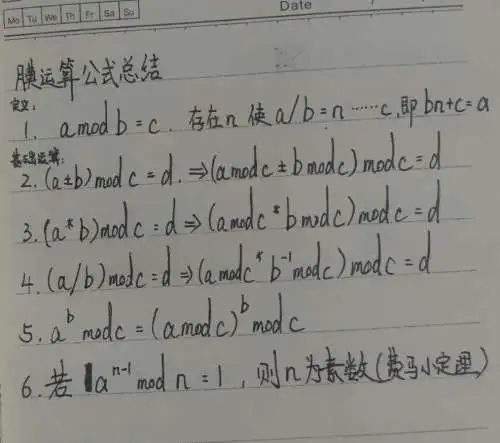

# 杂谈

* sakana缺密码学选手(23年).
* sakana战队的成立时间比较短, 对密码学方向掌握能力没有其他战队丰富;
* 学习以现代密码与量子计算为主;
* 密码学是一门越学越往前看的方向(pwn方向在学习中反而会往底层走).
* [战队维护文档](https://gitee.com/sakana_ctf/sagemath), sagemath可以在阿里云镜像安装或archwsl直装;

## 浅聊密码学

### 古典密码学

- 两个工具集:
  - [bugku系列](https://ctf.bugku.com/tools.html)
  - [cyberchef](https://gchq.github.io/CyberChef/)
  - [quipqiup](https://quipqiup.com)
- 摩斯密码, 维吉尼亚, (like 跳舞的小人)变种题, 旗语, 宇宙密码, 十六进制, [iot密码](https://hackertalk.net/posts/467492467444756480)......

### 现代密码学

  *注:现代密码学不代表是现在最前沿的东西, 在这里只是对一个阶段的密码学的统称*

#### 现代密码学有什么用

  [使用ssh进行连接](https://zhuanlan.zhihu.com/p/634030527)用到了rsa算法.

  区块链的货币加密(零知识证明)

#### 类型

对称加密:

* rsa
* ecc
* elgamal

流/块加密: 

* cbc
* IDEA (国际数据加密算法)

护网考点:

* AES(shiro721)
* DES(shiro550)

#### 关于模运算

模运算的一些基本公式:



为什么在进行elgamal题目时会出现问题: 

膜反并非简单的先求-1次方再取模, [可以参见invmod函数](https://gitee.com/cryingn/libnum)

#### xor

* 可逆性: 任意a xor b = c, 有b xor c = a, c xor a = b .....
  
  #### rsa

##### rsa在日常生活中常见

* 某游戏厂商被共模攻击(相同的d造成问题)
* ssh连接服务器(大部分使用rsa)
* rsa在ctf里面也算样板戏

##### 入门容易,工具广泛

- [rsa学习资料](https://zhuanlan.zhihu.com/p/48249182)

- [在线分解工具](http://factordb.com/)

- yafu 

##### 格基归约(LLL)

- [sagemath](https://www.sagemath.org) 

#### ecc

攻击手段:

* p = n特异曲线(smart攻击)
* n可分解(Pohlig-Hellman)

### 后量子密码时代

#### 量子计算机的来历

* 解决摩尔定律的挤牙膏问题
* 一些基本物理问题在足够微观的情况不适用
* 薛定谔的猫: 电子不只有0和1的状态

#### 量子编程在做什么

**参考<量子计算与量子信息(10周年版)>,作者:Michael A. Nielsen**
(个人总结的东西, 可能有问题, 欢迎指出)
`通信密码不分家`
香农和一堆前沿学者, 忘记叫什么了.

#### 量子编程与密码学

- [抗量子密码进展](https://www.bilibili.com/video/BV1qm4y1N7FV/?spm_id_from=333.337.search-card.all.click&vd_source=510c2d4ab36e496c1253326603079102).
- 据现在验证, 量子编程可以实现快速爆破rsa(CTF, 不记得是不是还可以搞ecc了).

#### 入坑算法

solovay-strassen测试算法证明了量子计算机可以判断一个数是否为素数

```python
import random

def jacobi(a, n):
    if n % 2 == 0:
        return None
    a = a % n
    t = 1
    while a != 0:
        while a % 2 == 0:
            a /= 2
            r = n % 8
            if r == 3 or r == 5:
                t = -t
        a, n = n, a
        if a % 4 == n % 4 == 3:
            t = -t
        a %= n
    if n == 1:
        return t
    else:
        return 0

def solovay_strassen(n, k=10):
    if n == 2:
        return True
    if n % 2 == 0:
        return False
    for i in range(k):
        a = random.randint(2, n - 1)
        x = jacobi(a, n)
        y = pow(a, (n - 1) / 2, n)
        if x == None or y != x % n:
            return False
    return True


print(solovay_strassen())
```

#### 学习推荐

- [量子编程基础数据推荐](https://gitee.com/OriginQ/Quantum-programming-textbook)
- 试用推荐:IBM(但是不让国人使用, 见仁见智)

## 未来方向

*密码学很有前景(暴论)*

### 通信协议

* tcp
* udp
* telnet
* smtp
* ftp
* https
* ssh
* ...

### socket编程

ctf出题中, 密码学方向出题(nc类型题目)需要对socket有一定了解.

### linux安全问题

- [经典题目](https://ctf.bugku.com/challenges/detail/id/65.html), 给我们对于密码学的学习提供了新的思路.
- openssh

## 畅聊时间

### 分享补充

- [shor算法](https://www.bilibili.com/video/BV1Ua411L7a9/?spm_id_from=333.337.search-card.all.click), 同样是量子计算中的重要算法(对rsa).
- [密码学资料](https://blog.soreatu.com/posts/how-to-start-to-learn-cryptography/):怎么学习密码学

